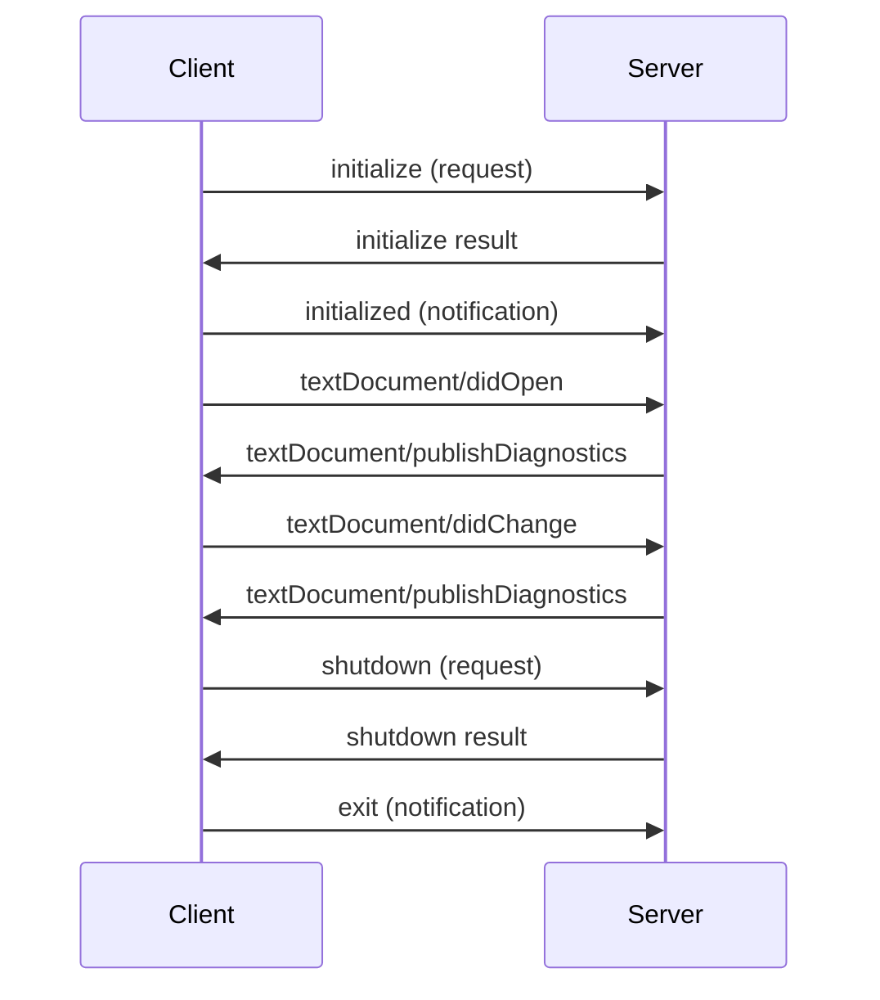

# Basic LSP Server

[](https://www.python.org/downloads/)
[](LICENSE)
[](https://microsoft.github.io/language-server-protocol/)

A lightweight, educational Language Server Protocol (LSP) implementation written in pure Python using only the standard library. Perfect for learning about LSP internals or as a foundation for building your own language server.

## 📖 What is a Language Server Protocol (LSP) Server?

The [Language Server Protocol (LSP)](https://microsoft.github.io/language-server-protocol/) is an open protocol created by Microsoft that standardizes the communication between code editors/IDEs and language intelligence tools (language servers). 

**Key Benefits:**
- 🔄 **Write Once, Use Everywhere**: A single language server can work with any LSP-compatible editor (VS Code, Neovim, Emacs, Sublime Text, etc.)
- 🚀 **Rich IDE Features**: Provides code completion, go-to-definition, diagnostics, hover information, and more
- 🎯 **Separation of Concerns**: Decouples language-specific logic from editor implementations
- 💡 **Community Standard**: Industry-wide adoption means consistent developer experience

**How it Works:**

```
┌─────────────┐          JSON-RPC          ┌──────────────┐
│   Editor    │ ◄────────────────────────► │ LSP Server   │
│  (Client)   │    (over stdin/stdout)     │ (This Code)  │
└─────────────┘                            └──────────────┘
```

The editor sends notifications about file changes, and the server responds with diagnostics, code suggestions, and other language intelligence.

## ✨ Key Features

This implementation demonstrates core LSP capabilities:

### 🔄 Lifecycle Management
- **Initialize Handshake**: Proper client-server capability negotiation
- **Graceful Shutdown**: Clean termination with resource cleanup
- **Server Capabilities Advertisement**: Tells clients what features are supported

### 📝 Text Document Synchronization
- **Document Open/Close**: Tracks active documents in the workspace
- **Content Changes**: Real-time synchronization of document edits
- **Full Document Sync**: Maintains complete document state (no incremental diffs)

### 🔍 Intelligent Diagnostics
The server analyzes text documents and reports issues in real-time:

| Diagnostic Type | Severity | Description |
|----------------|----------|-------------|
| TODO Comments | ℹ️ Info | Flags `TODO` markers for tracking work items |
| FIXME Comments | ⚠️ Warning | Highlights `FIXME` requiring immediate attention |
| Line Length | ⚠️ Warning | Detects lines exceeding 120 characters |
| Duplicate Lines | ℹ️ Info | Identifies consecutive duplicate lines |

### 🎯 Pure Python Implementation
- **Zero External Dependencies**: Uses only Python standard library
- **Educational Design**: Clean, well-documented code for learning
- **Lightweight**: Minimal resource footprint
- **Portable**: Runs anywhere Python 3.8+ is available

## 🎓 Use Cases

- **Learning LSP**: Understand how the protocol works under the hood
- **Prototyping**: Quickly build custom language servers
- **Teaching Tool**: Demonstrate language server concepts
- **Foundation**: Starting point for production language servers
- **Restricted Environments**: Deploy where external dependencies aren't allowed

## 📋 Requirements

- **Python**: Version 3.8 or higher
- **Platform**: Cross-platform (Linux, macOS, Windows)
- **Dependencies**: None! (Only Python standard library)

## 🚀 Installation

### Option 1: Direct Usage (No Installation)

```bash
# Clone the repository
git clone https://github.com/rkkeerth/lsp-server.git
cd lsp-server

# The server is ready to use
python3 server.py
```

### Option 2: Install as Package

```bash
# Clone and install
git clone https://github.com/rkkeerth/lsp-server.git
cd lsp-server

# Install with pip
pip install -e .

# Run the installed command
basic-lsp-server
```

### Option 3: System-wide Installation

```bash
# Install from PyPI (if published)
pip install basic-lsp-server

# Or install from source
python3 setup.py install
```

## 💻 Usage

### Quick Start: Test with Provided Client

The easiest way to test the server is using the included test client:

```bash
# Test with example file
python3 test_client.py examples/test.txt

# Test with your own file
python3 test_client.py /path/to/your/file.txt
```

**Example Output:**
```
============================================================
Diagnostics received for: file:///path/to/test.txt
============================================================
Found 4 issue(s):

  [INFO] Line 5, Col 0: TODO found: Consider addressing this item
  [WARNING] Line 12, Col 0: FIXME found: This requires immediate attention
  [WARNING] Line 15, Col 120: Line too long (145 > 120 characters)
  [INFO] Line 20, Col 0: Duplicate line detected
============================================================
```

### Running Standalone

The LSP server communicates via standard input/output using JSON-RPC 2.0:

```bash
# Start the server (reads from stdin, writes to stdout)
python3 server.py
```

The server will wait for LSP messages on stdin and respond on stdout.

### Automated Testing

Run the included test script to verify everything works:

```bash
# Make the script executable
chmod +x run_test.sh

# Run tests
./run_test.sh
```

This will:
1. ✅ Verify Python version
2. ✅ Test the server with example files
3. ✅ Display diagnostic output
4. ✅ Confirm server lifecycle

## 🔧 Editor Integration

### Visual Studio Code

**Method 1: Using an LSP Client Extension**

1. Install the [Generic LSP Client](https://marketplace.visualstudio.com/items?itemName=rehansaeed.lsp-client) extension
2. Add to your `.vscode/settings.json`:

```json
{
  "lsp-client.servers": {
    "basic-lsp": {
      "command": ["python3", "/absolute/path/to/lsp-server/server.py"],
      "filetypes": ["txt", "text", "plaintext"],
      "settings": {}
    }
  }
}
```

**Method 2: Create Custom Extension**

See the [VS Code LSP Extension Guide](https://code.visualstudio.com/api/language-extensions/language-server-extension-guide) for creating a dedicated extension.

### Neovim

Add to your Neovim configuration (`~/.config/nvim/init.lua`):

```lua
-- Start the LSP server
vim.api.nvim_create_autocmd("FileType", {
  pattern = { "text", "txt" },
  callback = function()
    vim.lsp.start({
      name = 'basic-lsp-server',
      cmd = {'python3', '/absolute/path/to/lsp-server/server.py'},
      root_dir = vim.fs.dirname(vim.fs.find({'*.txt'}, { upward = true })[1]),
    })
  end,
})
```

Restart Neovim and open a `.txt` file. Check status with `:LspInfo`.

### Emacs (lsp-mode)

Add to your Emacs configuration (`~/.emacs.d/init.el`):

```elisp
(require 'lsp-mode)

;; Register the LSP client
(lsp-register-client
 (make-lsp-client 
  :new-connection (lsp-stdio-connection 
                   '("python3" "/absolute/path/to/lsp-server/server.py"))
  :major-modes '(text-mode)
  :server-id 'basic-lsp-server))

;; Enable LSP for text files
(add-hook 'text-mode-hook #'lsp)
```

### Sublime Text

Install [LSP](https://packagecontrol.io/packages/LSP) package, then add to your LSP settings:

```json
{
  "clients": {
    "basic-lsp-server": {
      "enabled": true,
      "command": ["python3", "/absolute/path/to/lsp-server/server.py"],
      "selector": "text.plain"
    }
  }
}
```

### Other Editors

Any editor supporting LSP can use this server. Check your editor's LSP documentation for configuration details:
- **Vim**: Use [vim-lsp](https://github.com/prabirshrestha/vim-lsp)
- **Atom**: Use [atom-ide-ui](https://atom.io/packages/atom-ide-ui)
- **Eclipse**: Built-in LSP support via [LSP4E](https://projects.eclipse.org/projects/technology.lsp4e)

## ⚙️ Configuration Options

Currently, the server runs with default settings. Future versions will support configuration via:

### Workspace Configuration

```json
{
  "basicLspServer.maxLineLength": 120,
  "basicLspServer.diagnostics.enableTodo": true,
  "basicLspServer.diagnostics.enableFixme": true,
  "basicLspServer.diagnostics.enableDuplicateLines": true
}
```

### Environment Variables

```bash
# Set log level
export LSP_LOG_LEVEL=DEBUG

# Set log file location
export LSP_LOG_FILE=/custom/path/lsp-server.log
```

*Note: Configuration support is planned for future releases.*

## 🏗️ Architecture

### Protocol Overview

The server implements JSON-RPC 2.0 over stdin/stdout:

```
Message Format:
┌───────────────────────────┐
│ Content-Length: 123\r\n   │  ← Header
│ \r\n                      │  ← Separator
│ {"jsonrpc":"2.0",...}    │  ← JSON Payload
└───────────────────────────┘
```

### Message Types

1. **Request**: Expects a response (has `id` field)
   ```json
   {"jsonrpc":"2.0", "id":1, "method":"initialize", "params":{...}}
   ```

2. **Response**: Reply to a request (has `id` field)
   ```json
   {"jsonrpc":"2.0", "id":1, "result":{...}}
   ```

3. **Notification**: No response expected (no `id` field)
   ```json
   {"jsonrpc":"2.0", "method":"textDocument/didOpen", "params":{...}}
   ```

### Server Components

```
LSPServer
├── Message Handler
│   ├── read_message()     - Parse stdin for JSON-RPC messages
│   └── send_message()     - Write JSON-RPC to stdout
├── Request Handlers
│   ├── initialize         - Capability negotiation
│   └── shutdown           - Graceful termination
├── Notification Handlers
│   ├── didOpen            - Document opened
│   ├── didChange          - Document modified
│   └── didClose           - Document closed
└── Analysis Engine
    └── analyze_document() - Diagnostic generation
```

### Typical Message Flow



## 🐛 Debugging and Logging

### Log Files

The server logs all activity to `/tmp/lsp-server.log`:

```bash
# Monitor logs in real-time
tail -f /tmp/lsp-server.log

# View recent logs
tail -n 100 /tmp/lsp-server.log

# Search for errors
grep ERROR /tmp/lsp-server.log
```

### Log Format

```
2024-01-08 10:30:15,123 - __main__ - INFO - Starting Basic LSP Server...
2024-01-08 10:30:15,456 - __main__ - INFO - Received message: initialize
2024-01-08 10:30:15,789 - __main__ - INFO - Handling initialize request
2024-01-08 10:30:16,012 - __main__ - INFO - Sent message: 1
```

### Common Log Messages

- `Starting Basic LSP Server...` - Server started successfully
- `Handling initialize request` - Client connected
- `Document opened: <uri>` - File opened in editor
- `Analysis complete: found X diagnostics` - Document analyzed
- `Server stopped` - Clean shutdown

## 🤝 Contributing

We welcome contributions! Here's how to get involved:

### Getting Started

1. **Fork the Repository**
   ```bash
   git clone https://github.com/rkkeerth/lsp-server.git
   cd lsp-server
   ```

2. **Create a Branch**
   ```bash
   git checkout -b feature/your-feature-name
   ```

3. **Make Your Changes**
   - Follow existing code style
   - Add tests for new features
   - Update documentation

4. **Test Your Changes**
   ```bash
   python3 test_client.py examples/test.txt
   ./run_test.sh
   ```

5. **Submit a Pull Request**
   - Describe your changes
   - Reference any related issues
   - Wait for review

### Development Guidelines

#### Code Style
- Follow [PEP 8](https://pep8.org/) style guide
- Use type hints where applicable
- Add docstrings to all functions/classes
- Keep lines under 120 characters

#### Adding New Diagnostics

To add a new diagnostic rule, modify `analyze_document()` in `server.py`:

```python
def analyze_document(self, text: str) -> List[Dict[str, Any]]:
    """Analyze text document and return diagnostics."""
    diagnostics = []
    lines = text.split('\n')
    
    for line_num, line in enumerate(lines):
        # Add your diagnostic logic here
        if your_condition(line):
            diagnostics.append({
                "range": {
                    "start": {"line": line_num, "character": start_col},
                    "end": {"line": line_num, "character": end_col}
                },
                "message": "Your diagnostic message",
                "severity": 2,  # 1=Error, 2=Warning, 3=Info, 4=Hint
                "source": "basic-lsp-server"
            })
    
    return diagnostics
```

#### Adding New LSP Features

1. **Add Handler Method**
   ```python
   def handle_text_document_hover(self, params: Dict[str, Any]) -> Dict[str, Any]:
       """Handle textDocument/hover request."""
       # Implementation here
       return {"contents": "Hover text"}
   ```

2. **Register Handler**
   ```python
   handlers = {
       "textDocument/hover": self.handle_text_document_hover,
   }
   ```

3. **Update Capabilities**
   ```python
   "capabilities": {
       "hoverProvider": True,
   }
   ```

### Areas for Contribution

We're especially interested in:

- 🎯 **New Diagnostic Rules**: Add more code analysis patterns
- 🚀 **Additional LSP Features**: Code completion, go-to-definition, etc.
- 📚 **Documentation**: Improve examples and tutorials
- 🧪 **Testing**: Expand test coverage
- 🎨 **Code Quality**: Refactoring and optimization
- 🌐 **Language Support**: Adapt for specific programming languages
- 🔧 **Configuration**: Add customizable settings

### Reporting Issues

Found a bug? Have a suggestion? [Open an issue](https://github.com/rkkeerth/lsp-server/issues) with:

- **Bug Reports**: Include Python version, OS, steps to reproduce, error logs
- **Feature Requests**: Describe the feature and its use case
- **Questions**: Check existing issues first, then ask away!

## 📜 License

This project is licensed under the **MIT License** - see the [LICENSE](LICENSE) file for details.

### What This Means

✅ **You Can:**
- Use commercially
- Modify and distribute
- Use privately
- Include in proprietary software

❌ **You Cannot:**
- Hold the authors liable
- Use authors' names for endorsement

📝 **You Must:**
- Include the original license
- State changes made to the code

## 📞 Contact & Support

### Getting Help

- 📖 **Documentation**: Read this README and code comments
- 💬 **Discussions**: [GitHub Discussions](https://github.com/rkkeerth/lsp-server/discussions)
- 🐛 **Bug Reports**: [GitHub Issues](https://github.com/rkkeerth/lsp-server/issues)
- 💡 **Feature Requests**: [GitHub Issues](https://github.com/rkkeerth/lsp-server/issues)

### Community

- **GitHub**: [@rkkeerth](https://github.com/rkkeerth)
- **Project**: [lsp-server](https://github.com/rkkeerth/lsp-server)

### Support the Project

If you find this project helpful:
- ⭐ **Star the repository** on GitHub
- 🐛 **Report bugs** and suggest features
- 🤝 **Contribute** code or documentation
- 📢 **Share** with others who might benefit

## 🎓 Learning Resources

### LSP Protocol
- [Official LSP Specification](https://microsoft.github.io/language-server-protocol/)
- [LSP Inspector](https://microsoft.github.io/language-server-protocol/inspector/) - Test your server
- [LSP Base Types](https://microsoft.github.io/language-server-protocol/specifications/lsp/3.17/specification/#baseTypes)

### Language Servers
- [Langserver.org](https://langserver.org/) - List of language servers
- [Creating Language Servers Guide](https://code.visualstudio.com/api/language-extensions/language-server-extension-guide)

### Python LSP Libraries
- [pygls](https://github.com/openlawlibrary/pygls) - Full-featured Python LSP framework
- [python-lsp-server](https://github.com/python-lsp/python-lsp-server) - Python language server

## 🚧 Roadmap

### Current Version: 0.1.0 (Basic Implementation)
- ✅ Initialize/Shutdown lifecycle
- ✅ Text document synchronization
- ✅ Basic diagnostics (TODO, FIXME, line length, duplicates)
- ✅ JSON-RPC 2.0 message handling

### Planned Features

#### Version 0.2.0 (Enhanced Diagnostics)
- 🔄 Incremental document synchronization
- 🔄 Configurable diagnostic rules
- 🔄 More sophisticated pattern detection
- 🔄 Performance optimizations

#### Version 0.3.0 (Code Intelligence)
- 🔄 Code completion (textDocument/completion)
- 🔄 Hover information (textDocument/hover)
- 🔄 Document symbols (textDocument/documentSymbol)
- 🔄 Signature help (textDocument/signatureHelp)

#### Version 0.4.0 (Advanced Features)
- 🔄 Go to definition (textDocument/definition)
- 🔄 Find references (textDocument/references)
- 🔄 Code actions (textDocument/codeAction)
- 🔄 Code formatting (textDocument/formatting)

#### Version 1.0.0 (Production Ready)
- 🔄 Multi-workspace support
- 🔄 Configuration via workspace/configuration
- 🔄 Full LSP 3.17 compliance
- 🔄 Comprehensive test suite
- 🔄 Performance benchmarking

### Long-term Goals
- Language-specific variants (Python LSP, JavaScript LSP, etc.)
- Plugin system for extensibility
- Web-based demo and playground
- VS Code extension package

## 📊 Project Status

- **Status**: Active Development
- **Version**: 0.1.0 (Alpha)
- **Stability**: Experimental/Educational
- **Python Support**: 3.8, 3.9, 3.10, 3.11, 3.12+
- **LSP Version**: 3.17 (partial implementation)

## 🙏 Acknowledgments

- **Microsoft** - For creating and maintaining the LSP specification
- **LSP Community** - For extensive documentation and examples
- **Contributors** - Everyone who has contributed to this project

## 📌 Quick Links

- [Language Server Protocol](https://microsoft.github.io/language-server-protocol/)
- [JSON-RPC 2.0 Specification](https://www.jsonrpc.org/specification)
- [VS Code Extension Guide](https://code.visualstudio.com/api/language-extensions/language-server-extension-guide)
- [Neovim LSP Documentation](https://neovim.io/doc/user/lsp.html)
- [Emacs LSP Mode](https://emacs-lsp.github.io/lsp-mode/)

---

<div align="center">

**[Getting Started](#-installation) • [Documentation](#-usage) • [Contributing](#-contributing) • [License](#-license)**

Made with ❤️ for the developer community

</div>
